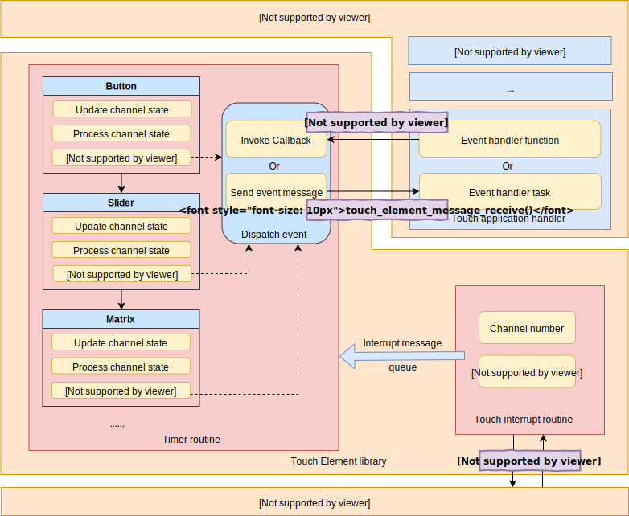
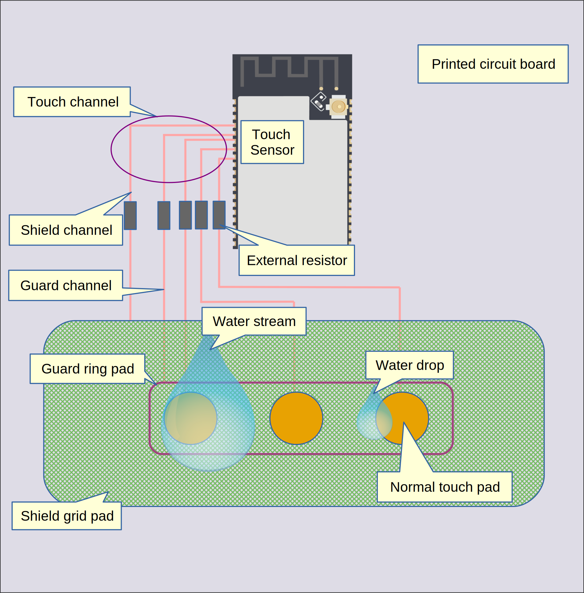
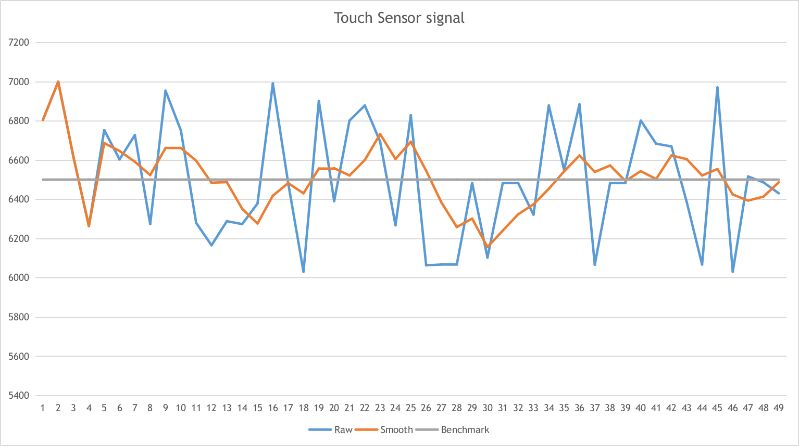
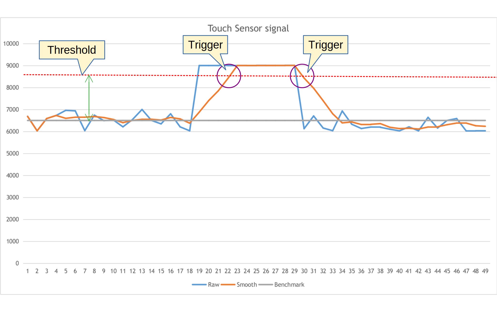
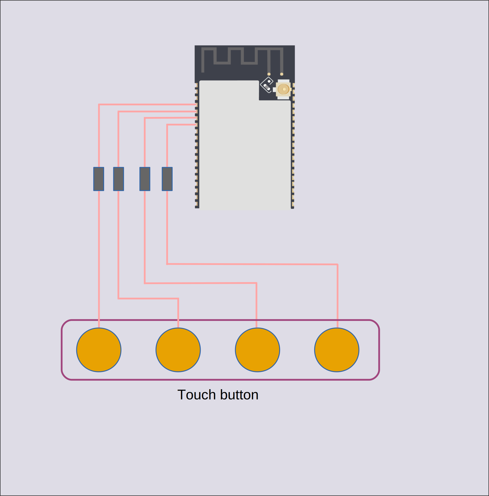
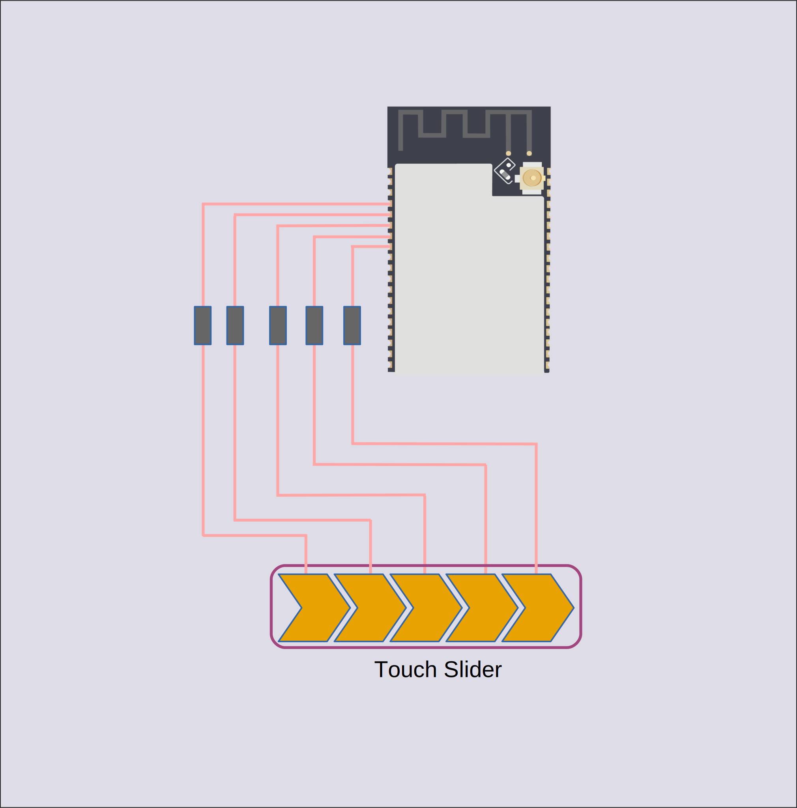
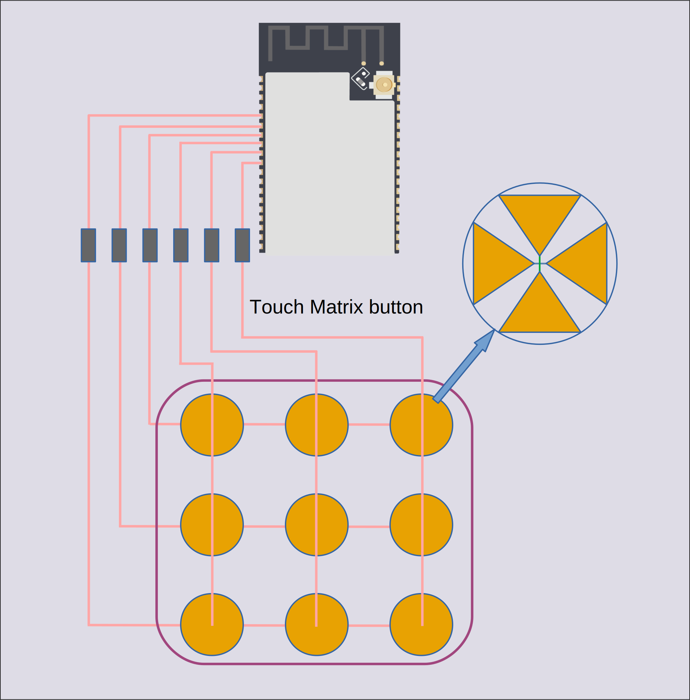

# Touch Element

## Overview

The Touch Element Library is a highly abstracted element library designed on the basis of the touch sensor driver. The library provides a unified and user-friendly software interface to quickly build capacitive touch sensor applications.

> WARNING: The Touch Element Library is only usable for the ESP32-S2 and ESP32-S3 chips.

> WARNING: The Touch Element Library currently is still based on the legacy touch driver. Please refer to the [new driver of Capacitive Touch Sensor](https://docs.espressif.com/projects/esp-idf/zh_CN/latest/esp32s3/api-reference/peripherals/cap_touch_sens.html) if you don't need the Touch Element Library.

### Architecture

The Touch Element library configures touch sensor peripherals via the touch sensor driver. However, some necessary hardware parameters should be passed to [touch_element_install](api.md#function-touch_element_install) and will be configured automatically only after calling [touch_element_start](api.md#function-touch_element_start). This sequential order is essential because configuring these parameters has a significant impact on the run-time system. Therefore, they must be configured after calling the start function to ensure the system functions properly.

These parameters include touch channel threshold, driver-level of waterproof shield sensor, etc. The Touch Element library sets the touch sensor interrupt and the esp_timer routine up, and the hardware information of the touch sensor (channel state, channel number) will be obtained in the touch sensor interrupt service routine. When the specified channel event occurs, the hardware information is passed to the esp_timer callback routine, which then dispatches the touch sensor channel information to the touch elements (such as button, slider, etc.). The library then runs a specified algorithm to update the touch element's state or calculate its position and dispatches the result accordingly.

So when using the Touch Element library, you are relieved from the implementation details of the touch sensor peripheral. The library handles most of the hardware information and passes the more meaningful messages to the event handler routine.

The workflow of the Touch Element library is illustrated in the picture below.



The features in relation to the Touch Element library in ESP32-S2 / ESP32-S3 are given in the table below.

| Touch Element waterproof | Touch Element button | Touch Element slider | Touch Element matrix button |
| :-----------------------: | :------------------: | :------------------: | :-------------------------: |
| ✔ | ✔ | ✔ | ✔ |


### Peripheral

ESP32-S2 / ESP32-S3 integrates one touch sensor peripheral with several physical channels.

- 14 physical capacitive touch channels
- Timer or software FSM trigger mode
- Up to 5 kinds of interrupt (Upper threshold and lower threshold interrupt, measure one channel finish and measure all channels finish interrupt, measurement timeout interrupt)
- Sleep mode wakeup source
- Hardware internal de-noise
- Hardware filter
- Hardware waterproof sensor
- Hardware proximity sensor

The channels are located as follows:

| Channel | GPIO |
|:-------:|:----:|
| CH0 | GPIO0 (internal) |
| CH1 | GPIO1 |
| CH2 | GPIO2 |
| CH3 | GPIO3 |
| CH4 | GPIO4 |
| CH5 | GPIO5 |
| CH6 | GPIO6 |
| CH7 | GPIO7 |
| CH8 | GPIO8 |
| CH9 | GPIO9 |
| CH10 | GPIO10 |
| CH11 | GPIO11 |
| CH12 | GPIO12 |
| CH13 | GPIO13 |
| CH14 | GPIO14 |

## Terminology

The terms used in relation to the Touch Element library are given below.

**Touch sensor**
- Touch sensor peripheral inside the chip

**Touch channel**
- Touch sensor channels inside the touch sensor peripheral

**Touch pad**
- Off-chip physical solder pad, generally inside the PCB

**De-noise channel**
- Internal de-noise channel, which is always Channel 0 and is reserved

**Shield sensor**
- One of the waterproof sensors for detecting droplets in small areas and compensating for the influence of water drops on measurements

**Guard sensor**
- One of the waterproof sensors for detecting extensive wading and to temporarily disable the touch sensor

**Shield channel**
- The channel that waterproof shield sensor connected to, which is always Channel 14

**Guard channel**
- The channel that waterproof guard sensor connected to

**Shield pad**
- Off-chip physical solder pad, generally is grids, and is connected to shield the sensor

**Guard pad**
- Off-chip physical solder pad, usually a ring, and is connected to the guard sensor



### Touch Sensor Signal

Each touch sensor is able to provide the following types of signals:

- Raw: The Raw signal is the unfiltered signal from the touch sensor.
- Smooth: The Smooth signal is a filtered version of the Raw signal via an internal hardware filter.
- Benchmark: The Benchmark signal is also a filtered signal that filters out extremely low-frequency noise.

All of these signals can be obtained using touch sensor driver API.



### Touch Sensor Signal Threshold

The Touch Sensor Threshold value is a configurable threshold value used to determine when a touch sensor is touched or not. When the difference between the Smooth signal and the Benchmark signal becomes greater than the threshold value (i.e., ``(smooth - benchmark) > threshold``), the touch channel's state will be changed and a touch interrupt will be triggered simultaneously.



### Sensitivity

Important performance parameter of the touch sensor, the larger it is, the better touch the sensor performs. It could be calculated by the format below:

$$
Sensitivity = \frac{Signal_{press} - Signal_{release}}{Signal_{release}} = \frac{Signal_{delta}}{Signal_{benchmark}}
$$

### Waterproof

Waterproof is the hardware feature of a touch sensor which has a guard sensor and shield sensor (always connect to Channel 14) that has the ability to resist a degree of influence of water drop and detect the water stream.


### Touch Button

The touch button consumes one channel of the touch sensor, and it looks like as the picture below:




### Touch Slider

The touch slider consumes several channels (at least three channels) of the touch sensor, the more channels consumed, the higher resolution and accuracy position it performs. The touch slider looks like as the picture below:



### Touch Matrix

The touch matrix button consumes several channels (at least 2 + 2 = 4 channels), and it gives a solution to use fewer channels and get more buttons. ESP32-S2 / ESP32-S3 supports up to 49 buttons. The touch matrix button looks like as the picture below:



## Touch Element Library Usage

Using this library should follow the initialization flow below:

1. To initialize the Touch Element library by calling [touch_element_install](api.md#function-touch_element_install).
2. To initialize touch elements (button/slider etc) by calling [touch_button_install](api.md#function-touch_button_install), [touch_slider_install](api.md#function-touch_slider_install) or [touch_matrix_install](api.md#function-touch_matrix_install).
3. To create a new element instance by calling [touch_button_create](api.md#function-touch_button_create), [touch_slider_create](api.md#function-touch_slider_create) or [touch_matrix_create](api.md#function-touch_matrix_create).
4. To subscribe events by calling [touch_button_subscribe_event](api.md#function-touch_button_subscribe_event), [touch_slider_subscribe_event](api.md#function-touch_slider_subscribe_event) or [touch_matrix_subscribe_event](api.md#function-touch_matrix_subscribe_event).
5. To choose a dispatch method by calling [touch_button_set_dispatch_method](api.md#function-touch_button_set_dispatch_method), [touch_slider_set_dispatch_method](api.md#function-touch_slider_set_dispatch_method) or [touch_matrix_set_dispatch_method](api.md#function-touch_matrix_set_dispatch_method) that tells the library how to notify you while the subscribed event occurs.
6. If dispatch by callback, call [touch_button_set_callback](api.md#function-touch_button_set_callback), [touch_slider_set_callback](api.md#function-touch_slider_set_callback) or [touch_matrix_set_callback](api.md#function-touch_matrix_set_callback) to set the event handler function.
7. To start the Touch Element library by calling [touch_element_start](api.md#function-touch_element_start).
8. If dispatch by callback, the callback will be called by the driver core when an event happens, no need to do anything; If dispatch by event task, create an event task and call [touch_element_message_receive](api.md#function-touch_element_message_receive) to obtain messages in a loop.
9. (Optional) If you want to suspend the Touch Element run-time system or for some reason that could not obtain the touch element message, [touch_element_stop](api.md#function-touch_element_stop) should be called to suspend the Touch Element system and then resume it by calling [touch_element_start](api.md#function-touch_element_start) again.

In code, the flow above may look like as follows:

```c

    static touch_button_handle_t element_handle; //Declare a touch element handle

    //Define the subscribed event handler
    void event_handler(touch_button_handle_t out_handle, touch_button_message_t out_message, void *arg)
    {
        //Event handler logic
    }

    void app_main()
    {
        //Using the default initializer to config Touch Element library
        touch_elem_global_config_t global_config = TOUCH_ELEM_GLOBAL_DEFAULT_CONFIG();
        touch_element_install(&global_config);

        //Using the default initializer to config Touch elements
        touch_slider_global_config_t elem_global_config = TOUCH_SLIDER_GLOBAL_DEFAULT_CONFIG();
        touch_slider_install(&elem_global_config);

        //Create a new instance
        touch_slider_config_t element_config = {
            ...
            ...
        };
        touch_button_create(&element_config, &element_handle);

        //Subscribe the specified events by using the event mask
        touch_button_subscribe_event(element_handle, TOUCH_ELEM_EVENT_ON_PRESS | TOUCH_ELEM_EVENT_ON_RELEASE, NULL);

        //Choose CALLBACK as the dispatch method
        touch_button_set_dispatch_method(element_handle, TOUCH_ELEM_DISP_CALLBACK);

        //Register the callback routine
        touch_button_set_callback(element_handle, event_handler);

        //Start Touch Element library processing
        touch_element_start();
    }
```


### Initialization

1. To initialize the Touch Element library, you have to configure the touch sensor peripheral and Touch Element library by calling [touch_element_install](api.md#function-touch_element_install) with [touch_elem_global_config_t](api.md#struct-touch_elem_global_config_t), the default initializer is available in [TOUCH_ELEM_GLOBAL_DEFAULT_CONFIG](api.md#define-touch_elem_global_default_config) and this default configuration is suitable for the most general application scene, and it is suggested not to change the default configuration before fully understanding Touch Sensor peripheral because some changes might bring several impacts to the system.

2. To initialize the specified element, all the elements will not work before its constructor [touch_button_install](api.md#function-touch_button_install), [touch_slider_install](api.md#function-touch_slider_install) or [touch_matrix_install](api.md#function-touch_matrix_install) is called so as to save memory, so you have to call the constructor of each used touch element respectively, to set up the specified element.


### Touch Element Instance Startup

1. To create a new touch element instance, call [touch_button_create](api.md#function-touch_button_create), [touch_slider_create](api.md#function-touch_slider_create) or [touch_matrix_create](api.md#function-touch_matrix_create), select a channel, and provide its `Sensitivity`_ value for the new element instance.

2. To subscribe to events, call [touch_button_subscribe_event](api.md#function-touch_button_subscribe_event), [touch_slider_subscribe_event](api.md#function-touch_slider_subscribe_event) or [touch_matrix_subscribe_event](api.md#function-touch_matrix_subscribe_event). The Touch Element library offers several events, and the event mask is available in [touch_element.h](https://github.com/espressif/idf-extra-components/tree/master/touch_element/include/touch_element/touch_element.h). You can use these event masks to subscribe to specific events individually or combine them to subscribe to multiple events.

3. To configure the dispatch method, use [touch_button_set_dispatch_method](api.md#function-touch_button_set_dispatch_method), [touch_slider_set_dispatch_method](api.md#function-touch_slider_set_dispatch_method) or [touch_matrix_set_dispatch_method](api.md#function-touch_matrix_set_dispatch_method). The Touch Element library provides two dispatch methods defined in [touch_elem_dispatch_t](api.md#enum-touch_elem_dispatch_t): `TOUCH_ELEM_DISP_EVENT` and `TOUCH_ELEM_DISP_CALLBACK`. These methods allow you to obtain the touch element message and handle it using different approaches.

### Events Processing

If `TOUCH_ELEM_DISP_EVENT` dispatch method is configured, you need to start up an event handler task to obtain the touch element message, all the elements' raw message could be obtained by calling [touch_element_message_receive](api.md#function-touch_element_message_receive), then extract the element-class-specific message by calling the corresponding message decoder with [touch_button_get_message](api.md#function-touch_button_set_callback), [touch_slider_get_message](api.md#function-touch_slider_get_message) to get the touch element's extracted message; If `TOUCH_ELEM_DISP_CALLBACK` dispatch method is configured, you need to pass an event handler by calling [touch_slider_set_callback](api.md#function-touch_slider_set_callback) or [touch_matrix_get_message](api.md#function-touch_matrix_get_message) to get the touch element's extracted message; If `TOUCH_ELEM_DISP_CALLBACK` dispatch method is configured, you need to pass an event handler by calling [touch_matrix_set_callback](api.md#function-touch_matrix_set_callback) before the touch element starts working, all the element's extracted message will be passed to the event handler function.

> WARNING: Since the event handler function runs on the core of the element library, i.e., in the esp_timer callback routine, please avoid performing operations that may cause blocking or delays, such as calling `vTaskDelay`.

In code, the events handle procedure may look like as follows:

```c

    /* ---------------------------------------------- TOUCH_ELEM_DISP_EVENT ----------------------------------------------- */
    void element_handler_task(void *arg)
    {
        touch_elem_message_t element_message;
        while(1) {
            if (touch_element_message_receive(&element_message, Timeout) == ESP_OK) {
                const touch_matrix_message_t *extracted_message = touch_matrix_get_message(&element_message); //Decode message
                ... //Event handler logic
            }
        }
    }
    void app_main()
    {
        ...

        touch_matrix_set_dispatch_method(element_handle, TOUCH_ELEM_DISP_EVENT);  //Set TOUCH_ELEM_DISP_EVENT as the dispatch method
        xTaskCreate(&element_handler_task, "element_handler_task", 2048, NULL, 5, NULL);  //Create a handler task

        ...
    }
    /* -------------------------------------------------------------------------------------------------------------- */

    ...
    /* ---------------------------------------------- TOUCH_ELEM_DISP_CALLBACK ----------------------------------------------- */
    void element_handler(touch_matrix_handle_t out_handle, touch_matrix_message_t out_message, void *arg)
    {
        //Event handler logic
    }

    void app_main()
    {
        ...

        touch_matrix_set_dispatch_method(element_handle, TOUCH_ELEM_DISP_CALLBACK);  //Set TOUCH_ELEM_DISP_CALLBACK as the dispatch method
        touch_matrix_set_callback(element_handle, element_handler);  //Register an event handler function

        ...
    }
    /* -------------------------------------------------------------------------------------------------------------- */
```


### Waterproof Usage

1. The waterproof shield sensor is always-on after Touch Element waterproof is initialized, however, the waterproof guard sensor is optional, hence if the you do not need the guard sensor, ``TOUCH_WATERPROOF_GUARD_NOUSE`` has to be passed to [touch_element_waterproof_install](api.md#function-touch_element_waterproof_install) by the configuration struct.

2. To associate the touch element with the guard sensor, pass the touch element's handle to the Touch Element waterproof's masked list by calling [touch_element_waterproof_add](api.md#function-touch_element_waterproof_add). By associating a touch element with the Guard sensor, the touch element will be disabled when the guard sensor is triggered by a stream of water so as to protect the touch element.

The Touch Element Waterproof example is available under the `examples/touch_element_waterproof` directory.

In code, the waterproof configuration may look as follows:

```c

    void app_main()
    {
        ...

        touch_button_install();                 //Initialize instance (button, slider, etc)
        touch_button_create(&element_handle);   //Create a new Touch element

        ...

        touch_element_waterproof_install();              //Initialize Touch Element waterproof
        touch_element_waterproof_add(element_handle);   //Let an element associate with the guard sensor

        ...
    }
```

### Wakeup from Light/Deep-sleep Mode

Only Touch Button can be configured as a wake-up source.

Light- or Deep-sleep modes are both supported to be wakened up by a touch sensor. For the Light-sleep mode, any installed touch button can wake it up. But only the sleep button can wake up from Deep-sleep mode, and the touch sensor will do a calibration immediately, the reference value will be calibrated to a wrong value if our finger does not remove timely. Though the wrong reference value recovers after the finger removes away and has no effect on the driver logic, if you do not want to see a wrong reference value while waking up from Deep-sleep mode, you can call [touch_element_sleep_enable_wakeup_calibration](api.md#function-touch_element_sleep_enable_wakeup_calibration) to disable the wakeup calibration.

```c

    void app_main()
    {
        ...
        touch_element_install();
        touch_button_install();                 //Initialize the touch button
        touch_button_create(&element_handle);  //Create a new Touch element

        ...

        // ESP_ERROR_CHECK(touch_element_enable_light_sleep(&sleep_config));
        ESP_ERROR_CHECK(touch_element_enable_deep_sleep(button_handle[0], &sleep_config));
        // ESP_ERROR_CHECK(touch_element_sleep_enable_wakeup_calibration(button_handle[0], false)); // (optional) Disable wakeup calibration to prevent updating the benchmark to a wrong value

        touch_element_start();

        ...
    }
```
